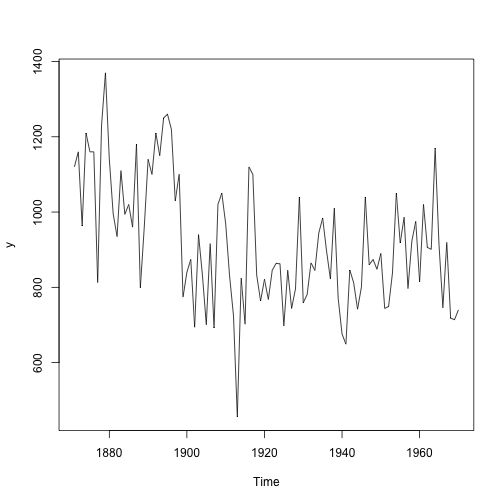

Final Lecture
========================================================
author: César Vargas
date: 
autosize: true

State space analysis for time series (with R)


A very basic state space model: The local model
========================================================
The local model assumes we observe a time series $y_t$, but this time series come from another time series (latent) $u_t$. Everything is corrupted by some noise $\epsilon_t$.

$$\begin{align*}
y_{t}= & u_{t}+\epsilon_{t} & \epsilon_{t}\sim N(0,\sigma_{\epsilon}^{2})\\
u_{t}= & u_{t-1}+\zeta_{t} & \zeta_{t}\sim N(0,\sigma_{\zeta}^{2})
\end{align*}$$

Three parameter model

Let's infer the parameters for the data set.
========================================================
It is possible to get the parameters of the local level model quite easy in R. Let's load some time series data.


Let's check how the data looks like

```r
plot(y)
```



Let's infer the parameters for the data set.
========================================================

```r
struct <- StructTS(y, type = "level")
struct$coef
```

```
    level   epsilon 
 1469.147 15098.577 
```

```r
cat("Transitional variance:", struct$coef["level"],
    "\n", "Observational variance:", struct$coef["epsilon"],
    "\n", "Initial level:", struct$model0$a, "\n")
```

```
Transitional variance: 1469.147 
 Observational variance: 15098.58 
 Initial level: 1120 
```

Let's do a local linear trend model
========================================================

$$\begin{align*}
y_{t}= & u_{t}+\epsilon_{t} & \epsilon_{t}\sim N(0,\sigma_{\epsilon}^{2})\\
u_{t}= & u_{t-1}+v_{t}+\zeta_{t} & \zeta_{t}\sim N(0,\sigma_{\zeta}^{2})\\
v_{t}= & v_{t-1}+\varsigma_{t} & \varsigma_{t}\sim N(0,\sigma_{\varsigma}^{2})
\end{align*}$$

Five parameter model

Let's do a local linear trend model
========================================================
In R?

```r
struct <- StructTS(y, type = "trend")
struct$coef
```

```
    level     slope   epsilon 
 1426.736     0.000 15047.325 
```

```r
cat("Transitional variance:", struct$coef["level"],
    "\n", "Slope variance:", struct$coef["slope"],
    "\n", "Observational variance:", struct$coef["epsilon"],
    "\n", "Initial level of mu:", struct$model0$a[1],
    "\n", "Initial level of lambda:", struct$model0$a[2],
    "\n")
```

```
Transitional variance: 1426.736 
 Slope variance: 0 
 Observational variance: 15047.33 
 Initial level of mu: 1120 
 Initial level of lambda: 0 
```

Let's do a local linear trend model
========================================================
Check slope variance and slope value. When both are zero, it might be that a local level model might explain better the data.

Smoothing
========================================================

```r
smoothed <- tsSmooth(struct)
plot(smoothed)
```


Diagnostics
========================================================

```r
y <- datasets::Nile
struct <- StructTS(y, type = "trend")
if (struct$code != 0) stop("optimizer did not converge")
tsdiag(struct)
```


Diagnostics
========================================================


Intervention, regression model, fixed coefficient
========================================================
$$\begin{align*}
y_{t}= & u_{t}+\lambda x_{t}+\epsilon_{t} & \epsilon_{t}\sim N(0,\sigma_{\epsilon}^{2})\\
u_{t}= & u_{t-1}+\zeta_{t} & \zeta_{t}\sim N(0,\sigma_{\zeta}^{2})
\end{align*}$$

Intervention, regression model, fixed coefficient
========================================================


```r
library(dlm)
y <- datasets::Nile
x <- cbind(c(rep(0, 27), rep(1, length(y) - 27)))
buildModReg <- function(v) {
    dV <- exp(v[1])
    dW <- c(exp(v[2]), 0)
    m0 <- v[3:4]
    dlmModReg(x, dV = dV, dW = dW, m0 = m0)
}
varGuess <- var(diff(y), na.rm = TRUE)
mu0Guess <- as.numeric(y[1])
lambdaGuess <- mean(diff(y), na.rm = TRUE)
parm <- c(log(varGuess), log(varGuess/5), mu0Guess,
    lambdaGuess)
mle <- dlmMLE(y, parm = parm, build = buildModReg)
if (mle$convergence != 0) stop(mle$message)
model <- buildModReg(mle$par)
```
Intervention, regression model, fixed coefficient
========================================================


```r
mle$par
```

```
[1]    9.736907   -3.016438 1119.999191   -3.847151
```
- First parameter $Log(\sigma_\epsilon)$
- Second parameter $Log(\sigma_\zeta)$
- Third parameter $u_0$
- Forth is $\lambda$
